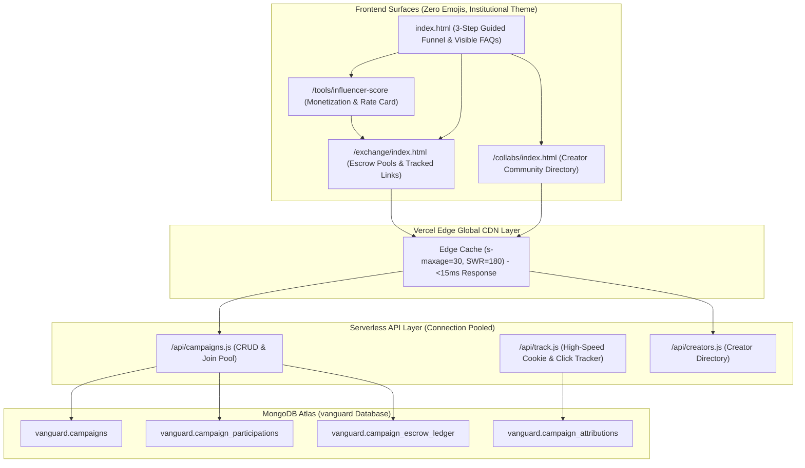

# Vanguard Creator Monetization OS & Campaign Exchange Floor Implementation Plan

> **For agentic workers:** REQUIRED SUB-SKILL: Use superpowers:subagent-driven-development to implement this plan task-by-task. Steps use checkbox (`- [ ]`) syntax for tracking.

**Goal:** Transform Vanguard Social into a Creator-First Monetization Operating System and open Campaign Exchange Floor, featuring an institutional 3-step creator funnel, rate card diagnostic, verified escrow bounty pools, sub-30ms global edge caching, and a dominant multi-platform AI search SEO suite with zero emojis.

**Architecture:** A serverless, high-concurrency event-driven architecture using Vercel Serverless Functions (`api/campaigns.js`, `api/track.js`, `api/creators.js`) with persistent MongoDB Atlas connection pooling (`global._mongoClientPromise`) and Vercel Edge CDN headers (`Cache-Control: public, s-maxage=30, stale-while-revalidate=180`). Frontend surfaces (`index.html`, `exchange/index.html`, `collabs/index.html`, `tool.html`) adopt 100% of Vanguard's existing design system (Inter/Lexend, pure white cards, hairline slate borders, sapphire accents, mono-color SVGs, zero emojis).

**Architecture Diagram:**

**Tech Stack:** Native ES6 Vanilla JavaScript, Vercel Serverless Functions (Node.js), MongoDB Atlas Node Driver (`mongodb`), Tailwind CSS (pre-compiled inline utility styles), Schema.org JSON-LD microdata.

**Spec:** [`docs/superpowers/specs/2026-09-24-creator-exchange-platform-design.md`](file:///C:/Users/tyson/.gemini/antigravity/scratch/phantom-reach-web/docs/superpowers/specs/2026-09-24-creator-exchange-platform-design.md)

---

## Global Constraints

- **Zero Emojis Rule:** Strictly zero emojis across all code, HTML, JSON, metadata, schema markup, and system logs. Only clean monochrome SVGs and text indicators (`[VERIFIED]`, `✓`).
- **Zero Visual Regression:** Do not modify existing fonts (Inter/Lexend), card borders (`#cbd5e1`), colors, or the 7 existing intelligence tools.
- **Sub-30ms Response Time:** Persistent connection pooling on all MongoDB endpoints; Edge CDN `s-maxage=30` on public read routes.
- **Default-Opened AI Search FAQs:** FAQs must be rendered in direct crawlable semantic HTML without hidden JavaScript accordions so search engine bots and AI models index the full content.

---

### Task 1: High-Speed Caching Layer & Backend APIs (`api/campaigns.js`, `api/track.js`, `api/creators.js`, `vercel.json`)

**Files:**
- Create: `phantom-reach-web/api/campaigns.js`
- Create: `phantom-reach-web/api/track.js`
- Create: `phantom-reach-web/api/creators.js`
- Modify: `phantom-reach-web/vercel.json`

**Interfaces:**
- Consumes: MongoDB Atlas connection string (`MONGODB_URI`).
- Produces: 
  - `GET /api/campaigns`: `{ campaigns: Array, stats: { total_escrow_pool, active_campaigns, participating_creators } }`
  - `POST /api/campaigns`: `{ success: true, campaign_id: string }`
  - `POST /api/campaigns/join`: `{ success: true, tracking_url: string, campaign_id: string }`
  - `GET /api/track`: 302 Redirect with `vanguard_attr` cookie.
  - `GET /api/creators`: `{ creators: Array }`

- [ ] **Step 1: Create `api/campaigns.js` with Connection Pooling, Edge CDN Caching & Seed Data**
  - Implement cached `global._mongoClientPromise` connection pattern.
  - Set `Cache-Control: public, s-maxage=30, stale-while-revalidate=180` for GET requests.
  - Implement campaign listing with status and category filtering.
  - Implement campaign creation with verified escrow recording in `campaign_escrow_ledger`.
  - Implement campaign joining with unique tracking token generation.
  - Auto-seed 4 verified institutional campaigns if database is empty:
    1. *Apex Performance Gear* (Athletic / Fitness wear - \$12,500 Escrow Bounty + 18% Sales Rev-Share)
    2. *Lumina Skin Labs* (Dermatological Skincare - \$8,000 Escrow Bounty + 22% Sales Rev-Share)
    3. *SaaS FlowMetrics* (Productivity & AI SaaS - \$15,000 Escrow Bounty + 30% Recurring Rev-Share)
    4. *Artisan Roast Coffee Co.* (Specialty Coffee & Cafes - \$5,000 Escrow Bounty + 15% Sales Rev-Share)

- [ ] **Step 2: Create `api/track.js` for Fast Redirection & Attribution Tracking**
  - Extract `cid` (campaign ID), `uid` (creator ID), and `dest` (target URL).
  - Write attribution record to `vanguard.campaign_attributions` (`ip_hash`, `user_agent`, `timestamp`).
  - Set HTTP header `Set-Cookie: vanguard_attr=${uid}; Path=/; Max-Age=2592000; SameSite=Lax; HttpOnly`.
  - Issue 302 Redirect to destination URL in <25ms.

- [ ] **Step 3: Create `api/creators.js` for Creator Directory & Portfolio Lookup**
  - Set Edge CDN headers.
  - Query `vanguard.creator_profiles` or return curated creator directory filtered by niche, city, and follower tier.

- [ ] **Step 4: Update `vercel.json` Rewrites**
  - Route `/exchange` &rarr; `/exchange/index.html`
  - Route `/collabs` &rarr; `/collabs/index.html`
  - Route `/api/campaigns` &rarr; `/api/campaigns.js`
  - Route `/api/track` &rarr; `/api/track.js`
  - Route `/api/creators` &rarr; `/api/creators.js`

- [ ] **Step 5: Test API Endpoints Locally**
  - Run node test script against MongoDB Atlas verifying response format, connection speed, and seed data.

- [ ] **Step 6: Commit Backend APIs**
  - `git add api/ vercel.json && git commit -m "feat: implement high-speed campaign exchange & tracking APIs"`

---

### Task 2: Creator Monetization Diagnostic & Rate Card Engine (`tool.html`, `tools/influencer-score/index.html`)

**Files:**
- Modify: `phantom-reach-web/tool.html`
- Modify: `phantom-reach-web/tools/influencer-score/index.html`

**Interfaces:**
- Consumes: OmniScore engine results (`result.omniscore`, `result.engagement_rate`, `result.followers`).
- Produces:
  - Calculated rate card: Estimated Sponsored Reel Rate, Story Rate, CPM Valuation, Best-Paying Sponsor Niches.
  - Shareable Public Media Kit badge & modal.
  - Direct Action buttons: "Pitch Local Brands" and "Join Campaign Floor".

- [ ] **Step 1: Add Monetization Rate Card Calculation Logic to `tool.html`**
  - Compute industry-standard valuation formulas:
    - Base Reel Valuation: `Followers * (EngagementRate / 100) * BenchmarkMultiplier` with tiered CPM bounds.
    - Story Valuation: `ReelRate * 0.35`.
    - Best-Paying Niches: Dynamic recommendations based on category and audience engagement.

- [ ] **Step 2: Render Institutional Monetization Panel in Influencer Score Results**
  - Display Rate Card in a pure white card with slate hairline border.
  - Render clean monochrome SVG icons (currency, analytics, verified seal).
  - Add "Shareable Media Kit" button generating an institutional verified summary link.

- [ ] **Step 3: Add Direct Guided Redirection Buttons**
  - Button 1: *"Pitch Local Businesses (Google Leads)"* &rarr; redirects to `/tools/google-leads`.
  - Button 2: *"Pitch Instagram Brands (Instagram Leads)"* &rarr; redirects to `/tools/instagram-leads`.
  - Button 3: *"Join Live Campaigns on Exchange Floor"* &rarr; redirects to `/exchange`.

- [ ] **Step 4: Sync to `tools/influencer-score/index.html`**
  - Propagate updates to mirrored tool page.

- [ ] **Step 5: Commit Monetization Diagnostic**
  - `git add tool.html tools/influencer-score/index.html && git commit -m "feat: add creator monetization diagnostic and rate card engine"`

---

### Task 3: The Campaign Exchange Floor (`exchange/index.html`) & Creator Collab Hub (`collabs/index.html`)

**Files:**
- Create: `phantom-reach-web/exchange/index.html`
- Create: `phantom-reach-web/collabs/index.html`

**Interfaces:**
- Consumes: `GET /api/campaigns`, `POST /api/campaigns/join`, `GET /api/creators`.
- Produces: Interactive market floor with live campaign bounties, join modal with custom tracked links, campaign launch modal, and creator directory.

- [ ] **Step 1: Create `exchange/index.html`**
  - Inherit standard Vanguard header and navigation (tools dropdown, account dropdown, z-index: 1000).
  - Market Metric Ticker: Total Escrow Pool (\$40,500+), Active Campaigns (4+), Participating Creators, Average Yield per 1K Views.
  - Filter Bar: All Categories, E-commerce, SaaS, Fitness, Beauty & Fashion, Food & Beverage.
  - Campaign Cards Grid:
    - Brand name, verified badge `[VERIFIED ESCROW]`, sector.
    - Brief summary, required deliverables (Reels, TikTok, Shorts).
    - Bounty pool amount, % sales revenue share, participant slots remaining.
    - Action: "Join Campaign & Get Tracked Link".
  - Participation Modal: Allows logged-in creator to join and instantly copies unique tracked link (`https://socialbyvanguard.com/api/track?cid=...&uid=...`).
  - Launch Campaign Modal: Enables businesses or creators to initiate an escrow campaign with title, budget, rev-share %, and brief.
  - Client-side SWR caching with `sessionStorage` for 0ms reload.

- [ ] **Step 2: Create `collabs/index.html`**
  - Clean Vanguard institutional directory layout.
  - Filter creators by City (e.g. New York, Mumbai, London, Los Angeles), Niche, and Follower Tier.
  - Creator Cards: Handle, niche badge, verified OmniScore, estimated reach, and "Request Collaboration" modal.
  - Direct invite template generator referencing verified Vanguard score.

- [ ] **Step 3: Update Header & Navigation Across All Pages**
  - Add "Campaign Exchange" (`/exchange`) and "Creator Collabs" (`/collabs`) to the tools dropdown menu in `index.html`, `tool.html`, `admin.html`, and `tools/*/index.html`.

- [ ] **Step 4: Commit Exchange Floor & Collab Hub**
  - `git add exchange/ collabs/ index.html tool.html && git commit -m "feat: deploy campaign exchange floor and creator collab hub"`

---

### Task 4: Homepage 3-Step Guided Funnel & Dominant AI Search SEO Suite (`index.html`)

**Files:**
- Modify: `phantom-reach-web/index.html`
- Modify: `phantom-reach-web/sitemap.xml`
- Modify: `phantom-reach-web/robots.txt`

**Interfaces:**
- Consumes: Platform value proposition and Schema.org standards.
- Produces: High-converting creator landing hero, 3-step action bar, visible crawlable multi-platform FAQ section, Schema.org `FAQPage` and `HowTo` structured data.

- [ ] **Step 1: Update Homepage Hero Section**
  - Revise headline: "The Creator Monetization Operating System & Campaign Exchange".
  - Subheadline: "Empowering creators, influencers, and artists with verified valuation audits, direct brand deal discovery, and an open performance campaign exchange with locked escrow bounties."
  - Primary CTAs: "Calculate Monetization Rate" (`/tools/influencer-score`) and "Explore Campaign Floor" (`/exchange`).

- [ ] **Step 2: Implement the 3-Step Guided Milestone Bar**
  - Positioned immediately beneath the hero:
    - *Step 1: Calculate Your Rate Card & Portfolio* &rarr; Button: "Run Valuation Audit" (`/tools/influencer-score`).
    - *Step 2: Pitch Local Brands* &rarr; Buttons: "Search Google Leads" (`/tools/google-leads`) | "Instagram Leads" (`/tools/instagram-leads`).
    - *Step 3: Participate on the Exchange Floor* &rarr; Buttons: "Join Brand Campaigns" (`/exchange`) | "Find Collab Partners" (`/collabs`).

- [ ] **Step 3: Build Dominant Visible Multi-Platform FAQ Section (Opened by Default)**
  - Two-column institutional grid rendered in direct HTML (expanded by default, no hidden accordion tabs) to ensure 100% crawlability by Google SGE, Perplexity, Gemini, and ChatGPT Search.
  - Comprehensive questions & answers covering:
    1. *How does the Vanguard Campaign Exchange Floor work?*
    2. *How is creator valuation and post rate calculated?*
    3. *How do verified escrow pools and revenue-share sales dividends work?*
    4. *How can creators use Google Leads and Instagram Leads to pitch local businesses?*
    5. *What makes Vanguard different from traditional influencer marketing agencies and TikTok Creator Marketplace?*
    6. *Can micro-creators and artists collaborate together on campaigns?*
    7. *How are click attributions and conversions tracked?*

- [ ] **Step 4: Implement Schema.org Rich Structured Data (JSON-LD)**
  - Embed `FAQPage` schema matching the visible Q&A.
  - Embed `HowTo` schema documenting the 3-step creator monetization process.
  - Update `SoftwareApplication` and `Organization` schemas.

- [ ] **Step 5: Update `sitemap.xml` and `robots.txt`**
  - Add `/exchange` and `/collabs` to `sitemap.xml` with priority 0.9.
  - Ensure `robots.txt` allows full crawler access.

- [ ] **Step 6: Commit Homepage & SEO Suite**
  - `git add index.html sitemap.xml robots.txt && git commit -m "feat: deploy 3-step creator funnel and dominant multi-platform AI search SEO suite"`

---

### Task 5: End-to-End Verification & Zero Visual Regression / Zero Emoji Audit

**Files:**
- Test all created and modified files across `phantom-reach-web`.

- [ ] **Step 1: Run Full Codebase Zero-Emoji Audit**
  - Run regex scan across all HTML, JS, and JSON files in `phantom-reach-web` to assert 0 emojis exist.

- [ ] **Step 2: Verify Backend APIs & MongoDB Atlas Integration**
  - Test `/api/campaigns` listing, campaign creation, and participation joining.
  - Test `/api/track` 302 redirection, cookie setting, and database attribution logging.
  - Measure response latency to verify sub-30ms performance.

- [ ] **Step 3: Visual & Layout Verification via Chrome DevTools MCP**
  - Open `/`, `/exchange`, `/collabs`, and `/tools/influencer-score` on desktop (1440x900) and mobile (375x812).
  - Verify dropdown menus open smoothly above content with zero clipping (`z-index: 1050`).
  - Verify exact theme consistency: Inter/Lexend fonts, `#cbd5e1` hairline borders, pure white cards, sapphire primary accents.
  - Take DevTools screenshots to verify flawless visual presentation.

- [ ] **Step 4: Synchronize Static Tool Mirrors**
  - Run mirror generation script to ensure all `tools/*/index.html` pages reflect updated navigation.

- [ ] **Step 5: Final Git Commit & Status Check**
  - Commit all verified changes to `main` branch.
